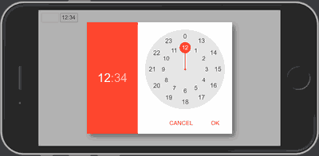

# Material Timepicker

## About
The Material Timepicker is lightweight standalone HTML5/JS(ES5)/CSS3 timepicker which offers a similar UI as the native Android timepicker.

## How to use
* include the the following files to your project: __material-timepicker.css__, __material-timepicker.js__
* now you can use the timepicker by adding `<input>` tags of type __mat-timepicker__ into your page
```html
<input type="mat-timepicker" maxlength="5">
<input type="mat-timepicker" value="15:42" placeholder="00:00" maxlength="5">
```
* override the default theme color by overriding the following css classes or leave the default blue theme
```css
.MatTimePicker-Clock .MatTimePicker-Popup,
.MatTimePicker-Clock .MatTimePicker-WatchHourBg,
.MatTimePicker-Clock .MatTimePicker-WatchStick,
.MatTimePicker-Clock .MatTimePicker-WatchCenterDot,
.MatTimePicker-Clock .MatTimePicker-Button:hover
{
    background-color: your-custom-background-color;
}

.MatTimePicker-Clock .MatTimePicker-Button {
    color: your-custom-button-text-color;
}
```
## Screenshots





## Examples
Here is a [sample](https://edgeelement.github.io/material-timepicker/demo/test.html) to see it in action.